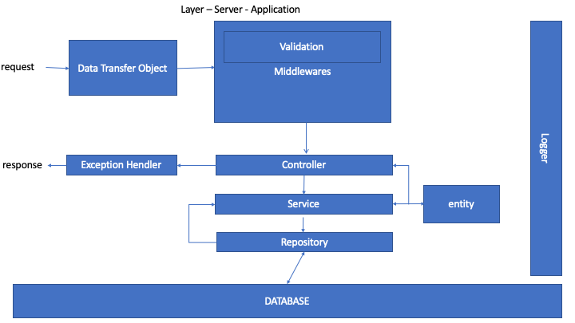

# Server boilerplate
_**Architecture of server app**_

## Commands

For initializing prisma `npx prisma init`

Migration of database `npx prisma migrate dev`

Generate DB `npm run generate`

Start development mode: `npm run dev`

Linting: `npm run lint`

Linting fix all: `npm run lint:fix`

Build `npm run build`

Start Production mode `npm run start`
